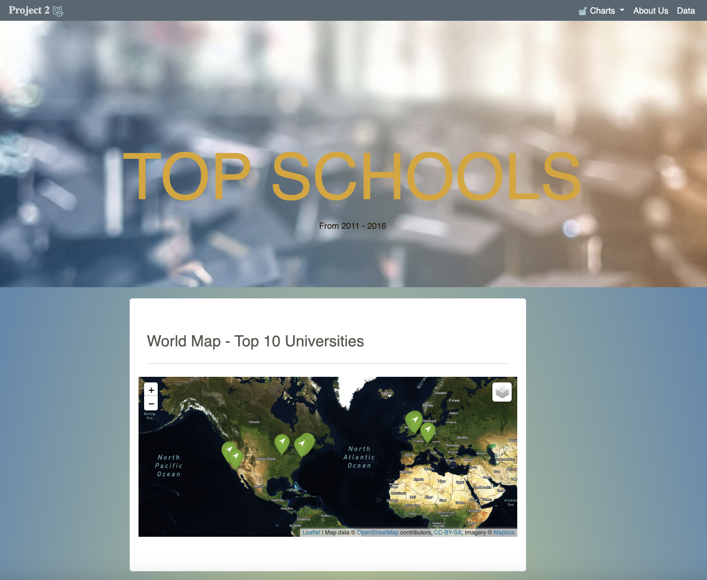

# GTProject2

Team Members:
Viera Garcia, Caroline Larry, Chithra Mohana Sundaram, Ting Jennings, William Powell

Topic:
World University Rankings
Investigate the best universities in the world

Data Sources:
https://www.kaggle.com/mylesoneill/world-university-rankings
Manually create csv with coordinates for top 15-25 universities

Details: A config.js file that had the API key from the world map and was located in the static folder, was Gitignore. 

Questions: 
Which country has the highest number of ranked universities?
How have the university rankings changed between 2012 and 2015?
How do the university rankings change based on different criteria?
Score comparisons: 
university score for research (volume, income and reputation)
university score for citations (research influence)
university score international outlook (staff, students, research)
university score for industry income (knowledge transfer)
university score for teaching (the learning environment)
number of students at the university
number of researchers per university

Potential Graphs:
Bar chart: number of top universities in different countries 
Represent the top 10 universities on different bar charts with different criteria
Scatterplot
Pie Chart
Line Chart - Top 5 world rank universities by CWUD from 2012-2015
Bubble Chart - (marker_size: , y : ,  x : )
Spider chart comparing top 3 universities for a specific year 

Interactive Features:
Drop-down menu: Filter data by year or by scoring system
When the user selects a specific university, a pop-up box will appear that includes the university’s information/ scores
Interactive map of top universities

